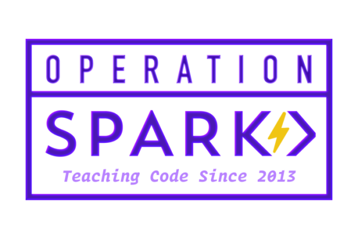

<h1 align='center'>
  <a href='https://operationspark.org' target='_blank'>
    
<b>OperationSpark.org Website</b>

    
  </a>
</h1>

## Development

- Install dependencies `npm i`
- Make a copy of [.env.sample](.env.sample) called `.env.development.local` in project root.
- Create/add necessary env variables (replace placeholders)
- Run project in development with `npm run dev`

## Production

- Install dependencies `npm i`
- Make a copy of [.env.sample](.env.sample) called `.env.local` in project root
- Build the project with `npm run build`
- Start the server with `npm start`

  

### Share links

- [Facebook share link debug tools](https://developers.facebook.com/tools/debug/?q=https%3A%2F%2Fwww.operationspark.org%2FgetInvolved%2Fdonate)
